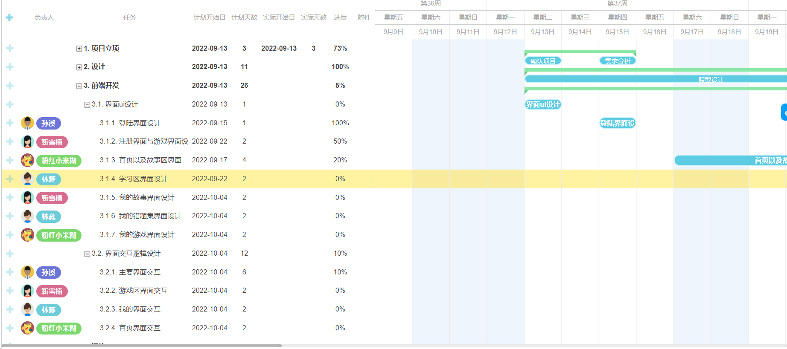

### 任务分配

##### 项目立项
1. 确认项目
2. 需求调研
3. 需求分析
----

##### 界面设计
1. 前期准备
    1. 素材收集
        1. ui素材
        2. 功能素材
    2. logo制作
2. 墨刀原型设计
---

##### 前端开发
1. 界面ui设计
    1. 登陆界面设计
    2. 注册界面与游戏界面设计
    3. 首页及故事界面设计
    4. 学习区界面设计
    5. 我的故事界面设计
    6. 我的错题集界面设计
    7. 我的游戏界面设计
2. 界面交互逻辑设计
    1. 主要界面交互
    2. 游戏区界面交互
    3. 我的界面交互
    4. 首页界面交互
---

##### 网络通信
1. 通信部份part1 
2. 通信部份part2
---

##### 后端开发
---

##### 软件上线
1. 软件打包
2. web
    1. web部分part1
    2. web部分part2
---

##### 用户反馈
---

##### 文档说明
1. prd撰写
2. 甘特图&任务分配说明
3. uml文档
4. 原型系统markdown
5. 测试文档
6. 用户说明
---

###### 进度安排
[在线链接](https://gantt.mindsup.cn/share/LOQlW4SbK)

---image/

    

