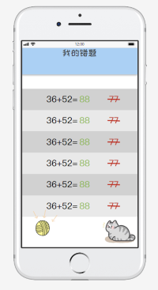

## StaryKit App原型系统设计
*[原型交互系统使用](https://modao.cc/app/iGu6G33Uri90ijbyjHDysm)*
### 原型及APP使用逻辑
#### 启动登录逻辑

#### 页面包含逻辑表
启动
登录
注册
* 注册成功
* 注册失败
首页
* 学习区
* 游戏区
* 故事区
我的
* 我的故事
* 我的错题
* 我的游戏
### 快速原型截图
#### 启动

#### 登录

#### 注册

##### 注册成功

#### 首页

##### 学习区

##### 游戏区

##### 故事区

#### 我的

##### 我的故事

##### 我的错题

##### 我的游戏

