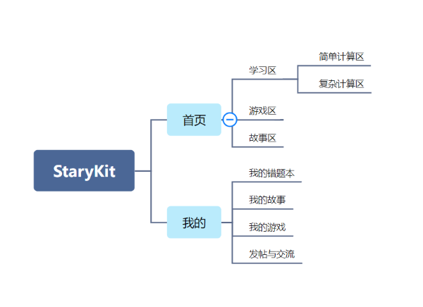
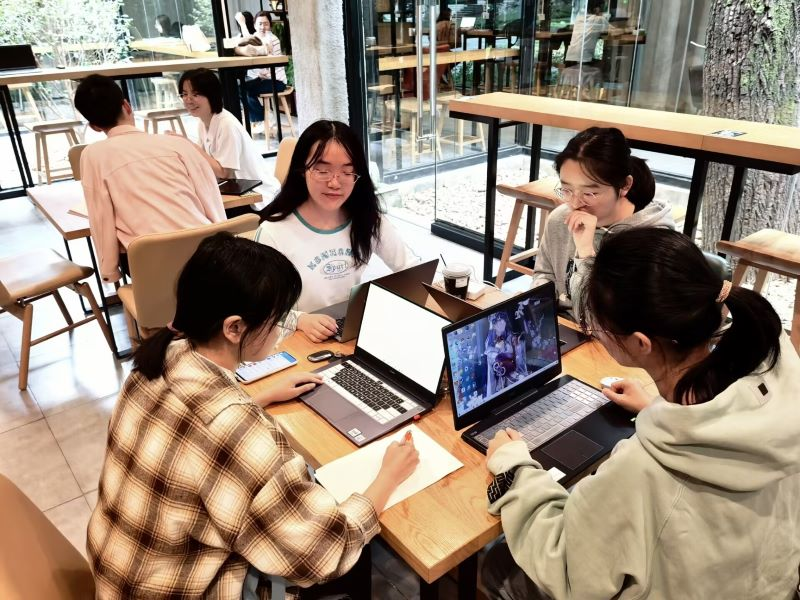
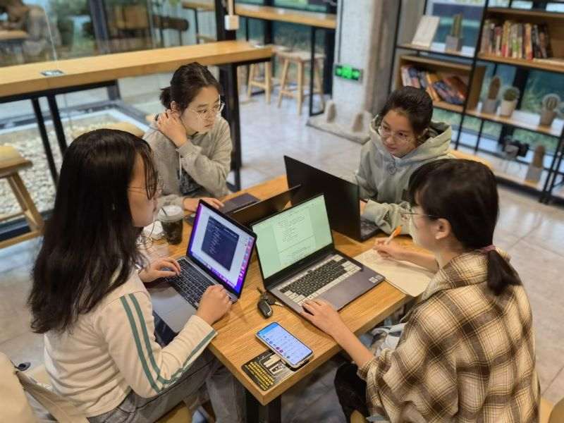

# 软件工程小组立项会议记录
* **参会者**：孙溪，靳雪楠，崔丽娟，林蕤
* **时间地点**：2022年9月18日周日 会饮咖啡厅
* **记录人**：靳雪楠 

## 项目选择
基于Android Studio开发的儿童学习+娱乐平台（APP）
### 1. 主要技术栈
Android开发（原生安卓和h5 native混合开发）
* MVP框架
* 网络通信（Retrofit）
* 页面搭建（XML）
* 路由管理（NacigationControler）
* 传参和跳转（Intent)
### 2. 主要任务
* 需求分析+立项
* 素材收集+界面设计+功能设计
* 前端开发（重点）
* 网络通信
* 后端开发
* 软件发布+上线
* 用户反馈+团队总结

## 项目分析
### 1. 现有同类产品优缺点分析
##### 市面现存的亲子软件有几大类：
###### `学习机，故事机`
* 优点：
	* 市场背景悠久，饱经捶打，已经形成了完整的销售体系和服务体系
	* 相较于以手机为承载体的软件，往往被家长更加信赖
* 缺点：
	* 价格相对昂贵，后期维护需要费用
	* 难以定制如用户之间的交互功能等扩展功能
	* 面向对象年龄条件趋小，年龄区间趋窄，只适合短时间使用
	* 强化儿童与学习机的交流，淡化家长与儿童的交流

###### `一些阅读，识字APP`
* 优点：做的更加精致
* 缺点：功能单一

###### `一些出题，游戏的H5网页`
* 优点：前人的资源，在一些算法上展现了程序员惊人的热情和智慧
* 缺点：功能单一，资源整合不完善

### 2. 本项目竞争力
* 界面面向儿童家长，逻辑简单清晰，用户可以迅速掌握使用方法，找到切合自己实际状况的各方面资源。
* 本平台整合轻度娱乐资源和学习资源，也希望弱化部分家长视娱乐游戏为洪水猛兽的陈旧观念，帮助小/大用户更好相互理解，相互交流。
* 后续时间充足考虑加入严经审核的发帖功能，起到用户与用户正能量育儿心得的交流作用。
### 3.项目需求
* 基础需求：
	* 注册
	* 登录
	* 首页三大区
		* 学习区(难度分层)
		* 游戏区
		* 故事区
	* 个人页面
* 进阶需求：
	* 用户发帖交流
	* 用户个性化
		* 错题本
		* 近期在看故事/收藏故事
		* 近期在玩游戏/收藏游戏

## 思维导图

## 会议图片

